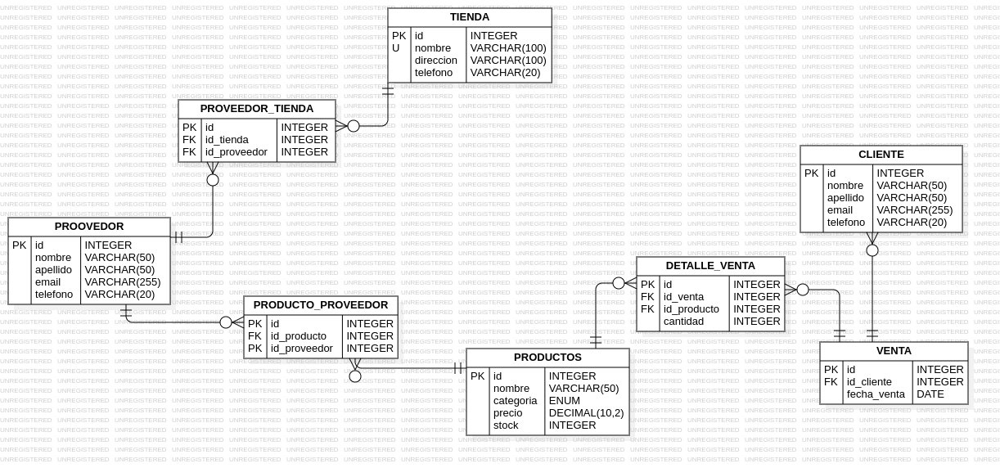

# Exámen Postgres
Mediante el siguiente proyecto se busca crear una base de datos teniendo en cuenta la siguiente problemática:
    La tienda **TechZone** es un negocio dedicado a la venta de productos tecnológicos, desde laptops y
    teléfonos hasta accesorios y componentes electrónicos. Con el crecimiento del comercio digital y
    la alta demanda de dispositivos electrónicos, la empresa ha notado la necesidad de mejorar la
    gestión de su inventario y ventas.

## Diagrama ER:
De acuerdo con la problemática planteada se creó el siguiente diagrama de la base de datos, con el fin de gestionar ventas.

## Tabla de Contenido:
Para la visualización de la base de datos ingrese a la base de datos de postgres y realice los siguiente:
```
CREATE DATABASE techzone;
\c techzone;
```
Posteriormente, ingrese a cada uno de los siguientes archivos
1.[Creación Tablas](db.sql)
2. [Inserción Datos](insert.sql)
3. [Consultas](queries.sql)
4. [Procedimientos](./procedureAndFunctions.sql)
